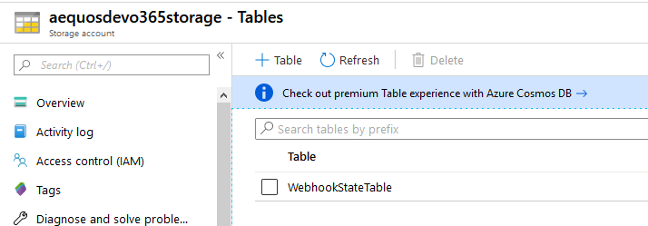
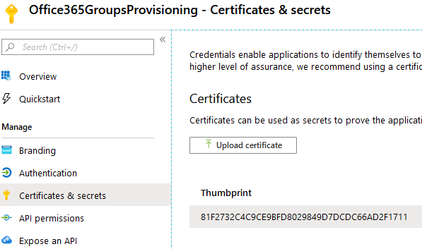
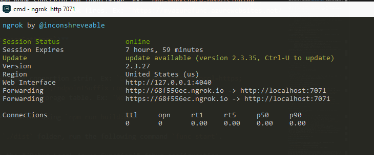
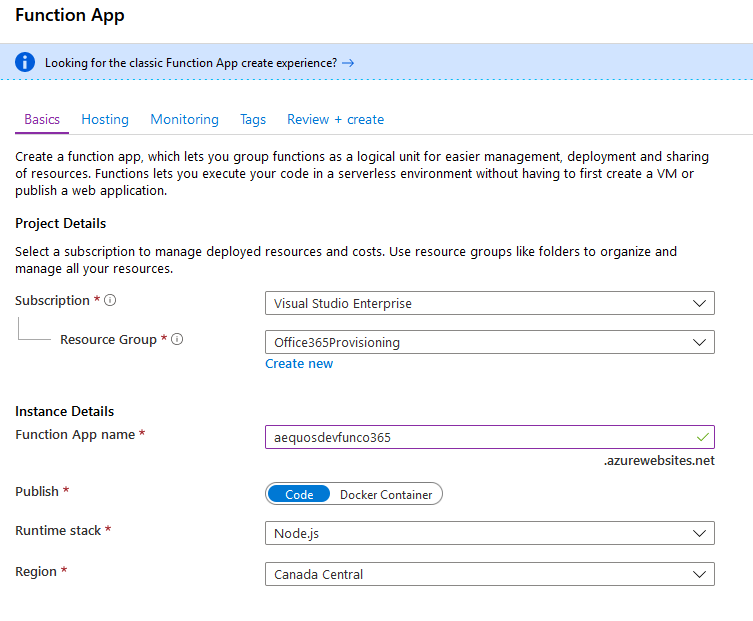
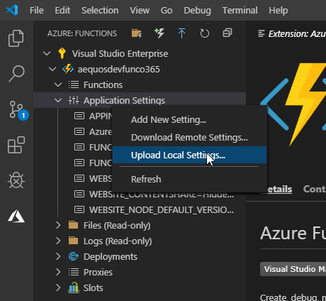
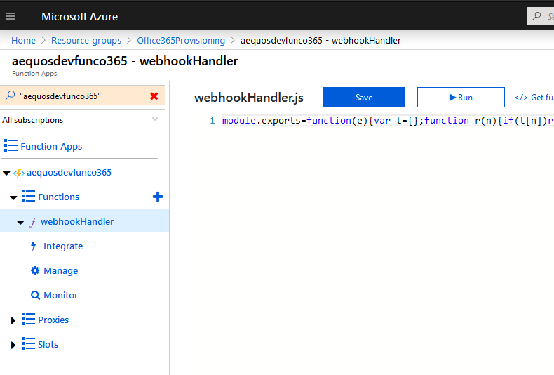

# Part 3 - Create and register SharePoint Webhook

The part 3 demonstrates how to create and register a SharePoint webhook to catch events from the workspace requests list. This allows to avoid using a costly Logic App polling trigger in a case of an heavy workload.

## Setup solution

1. Go to the `functions/sp-trigger-function` folder and install all dependencies using `npm i`.

1. Install [Azure CLI](https://docs.microsoft.com/en-us/cli/azure/install-azure-cli-windows?view=azure-cli-latest) on your machine. 

1. Install Azure Function Core tools globaly using `npm i -g azure-functions-core-tools@2.X` (version 2).

1. In the Azure storage account you created in the previous step, create a new table named '**WebhookStateTable**'. As its name suppose, this will used to 

    

1. Go to the `functions\sp-trigger-function` folder and run a `npm i` command.

1. Generate the certificate private key

    This solution uses an Azure AD application certificate connection to communicate with SharePoint for the web hook registration process. It means you need to generate a **certificate private key** in _*.pem_ format and copy it to the _'./config'_ folder of your function. You can reuse the certificate you created in previous steps. Then use the [OpenSSL](https://wiki.openssl.org/index.php/Binaries) tool and the following command to generate the _.pem_ key from the _.pfx_ certificate (use Cmder for the first command):

    ```bash
    openssl pkcs12 -in C:\<your_certificate>.pfx -nocerts -out C:\<your_certificate>.pem -nodes
    ```

1. Update sample the `local.settings.json` file according to the following settings: 

    | Setting | Value |
    | ------- | ----- |
    | `appId` | The Azure AD application client ID used to connect to SharePoint.
    | `tenant` | The tenant name. Ex: `mytenant`.
    | `resource` | The resource to access. Ex: `https://mytenant.sharepoint.com`
    | `certificateThumbPrint` | The certificate thumprint. Ex: `3366e28f1c95cff2680ae799f248e448f8655134`. You can get this value in the Azure AD Application: <br> 
    | `certificatePath` | The path to the .pem file. Ex `.\\config\\key.pem`.
    | `spListId` | The SharePoint list ID to connect to for webhook. (see PowerShell script below)
    | `spWebUrl` | The absolute web URL containing the SharePoint list. Ex: `https://mytenant.sharepoint.com/sites/workspaces`.
    | `webhookSubscriptionIdentifier` | The web hook subscription identifier. Ex: `pnp-workspace-provisioning`.
    | `webhookNotificationUrl` | The URL to call when the webhook fires. Typically your function URL. Ex: `http://68f556ec.ngrok.io/api/webhookhandler`
    | `webhookTargetUrl` | URL to trigger by the function. This will be the URL of the Logic App previously created. 
    | `azStorageConnectionString` | The Azure Storage connection string. Ex: `DefaultEndpointsProtocol=https;AccountName=<yourstoragename>;AccountKey=<key>;EndpointSuffix=core.windows.net`.
    | `azStorageTableName` | The name of the azure storage table. This table is used to keep track of changes in the list using a timestamp token. Ex: `WebhookStateTable`.

    Note: PowerShell script to get the list id
    ```PowerShell
    Connect-PnPOnline -Url https://tenant.sharepoint.com/sites/workspaces
    Get-PnPList |?{$_.Title -eq "Workspace requests"}
    ```

    Note: Azure CLI script to create the table storage
    ```bash
    az storage table create --name WebhookStateTable --account-name mwcp19practice
    ```

## Debug you function locally

1. In a Node.js console, build the solution using `npm run build:dev`

1. In a Node.js console, from the `./dist` folder, run the following command `func start`.

1. Install `npm i -g ngrok` and type the following command: `ngrok http 7071`. This way SharePoint will be able to reply to your local function via the ngrok proxy.

    

1. From Visual Studio Code, launch the *'Debug Local Azure Function'* debug configuration.

1. Open Postman, and send an empty POST query to the URL `http://<you_ngrok_url>/api/newworkspace`. It will register the webhook for the first time according to the local settings. The function should return `200` meaning the subscription has been created

    If you try to run it again, the subscription process will be skipped.

1. Put a debug breakpoint in your code and try to add a new item in the workspace requests list to ensure the webhook is triggered correctly.

    

## Deploy to Azure

Now we have a working function in localhost ,we likely want to deploy to Azure.

1. In the Azure resource group _Office365Provisioning_, create a new 'Function App'. Choose 'Node.js' as the runtime stack:

    

    Note: Azure CLI script to create the function app
    ```bash
    az functionapp create --resource-group mwcp19practice --consumption-plan-location canadaeast --name mwcp19practice --storage-account  mwcp19practice --runtime node
    ```

1. In VSCode, download the [Azure Function](https://code.visualstudio.com/tutorials/functions-extension/getting-started) extension.

    

1. Sign-in to to Azure account into the extension.
1. In a Node.js console, build the application using the command `npm run build` (minified version this time).
1. Use the **"Deploy to Function App"** feature (in the extension top bar) using the *'dist'* folder in the newly created function. Make sure you've run the `npm run build` cmd before.
1. Upload the application settings file according to your environment (`local.settings.json`).

    

    Note: Azure functions SDK command to deploy the app
    ```bash
    func azure functionapp publish mwcp19practice --publish-local-settings -i --overwrite-settings -y
    ```

1. Check the deployment by browsing the function in the Azure portal:

    

1. Register the webhook with SharePoint using the `Add-PnPWebhookSubscription` cmdlet. You can can the function URL in the Azure portal:

    
    ```PowerShell
    Connect-PnPOnline -Url https://<your_tenant>.sharepoint.com/sites/workspaces
    Add-PnPWebhookSubscription -List "Workspace requests" -NotificationUrl https://<you_func_name>.azurewebsites.net/api/webhookhandler
    ```


> Next part: [Part 4 - Setup end-user experience](./PART4.md)
